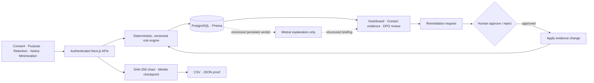

# ComplyLens — restrained four-slide deck brief

These are layout instructions, not invitations to invent content. Preserve the supplied copy and statistics exactly.

## Non-negotiable visual direction

- Make the deck look manually designed by a strong product team, not generated from a presentation template.
- Use a plain warm-white background, near-black text, and one deep-teal accent (`#0C6B58`). Amber is allowed only for risk.
- Use one sans-serif family such as Inter, Aptos, Helvetica, or Neue Haas Grotesk. Use weight and size for hierarchy—not multiple fonts.
- Use a 12-column grid, generous empty space, thin rules, square or lightly rounded corners, and consistent left alignment.
- Use real ComplyLens screenshots and a precise architecture diagram. Do not generate illustrations.
- Do not use gradients, glowing elements, abstract blobs, glassmorphism, 3D icons, stock photos, fake device mockups, decorative circuits, floating cards, or excessive pills.
- Do not put every sentence inside a box. Avoid symmetrical three-card layouts unless the content genuinely requires comparison.
- Keep titles at 32–38 pt, body copy at 17–20 pt, and source notes at 10–11 pt. Maximum 45–55 words of body copy per slide, excluding labels and sources.
- Use subtle page numbers `01—04` in the bottom-right corner.
- Team: **Cloud Code**. Product: **ComplyLens**.

## Slide 1 — Problem Statement + facts and figures

### Exact content

**CLOUD CODE / COMPLYLENS**

**Problem Statement**

> Indian organisations process personal data across consent, purpose, retention, notice and service systems, but compliance teams lack a single operational layer that converts this evidence into reproducible DPDP assessments, prioritised remediation and a verifiable human approval trail.

**Facts and figures**

- **969.10M** internet subscribers in India, March 2025 — TRAI
- **29.44 lakh** cyber-security incidents tracked in 2025 — CERT-In/PIB
- **₹250 crore** statutory maximum for failure to take reasonable security safeguards — DPDP Act Schedule

**Thesis**

> Deterministic rules decide. AI explains. Humans approve.

### Layout instruction

> Design a restrained 16:9 opening slide. Put “CLOUD CODE / COMPLYLENS” as a small uppercase label at top-left. Use the left 58% for the “Problem Statement” heading and the exact statement above, set large and editorially. Use the right 34% for the three facts as large numbers separated only by thin horizontal rules—do not use cards, icons, circles or illustrations. Put the thesis as a single teal line near the bottom-left. Add a quiet source footer. Make “Problem Statement” explicit; do not replace it with a marketing slogan. Add a small note below 29.44 lakh saying “Cyber-security incidents, not personal-data breaches,” and below ₹250 crore saying “Statutory maximum; not predicted liability.”

Sources:

- TRAI: https://trai.gov.in/sites/default/files/2025-07/PR_No.55of2025.pdf
- PIB/CERT-In: https://www.pib.gov.in/PressReleasePage.aspx?PRID=2244504&lang=1&reg=3
- DPDP Act: https://www.meity.gov.in/static/uploads/2024/06/2bf1f0e9f04e6fb4f8fef35e82c42aa5.pdf

## Slide 2 — System architecture

### Exact content

**Architecture — the decision boundary is explicit**

Evidence → authenticated application → deterministic rule engine → persisted assessment → human-approved remediation

AI reads only minimized persisted verdict metadata and produces structured explanations. It cannot score, change status or write compliance results.

### Layout instruction

> Design a technical architecture slide that resembles an engineering design review, not an infographic. Use one full-width left-to-right diagram on a faint grid. Begin with evidence sources: Consent, Purpose, Retention, Notice and Minimization. Connect them to Next.js authenticated APIs, then to a bold outlined “Deterministic Rule Engine” boundary, then PostgreSQL/Prisma append-only assessments. From persisted assessments branch upward to dashboards and downward to SHA-256 hash chain, Merkle checkpoints, CSV and JSON proof exports. Place Mistral above and outside the decision boundary with a one-way dashed arrow labelled “Explain persisted verdict only.” Show one clean feedback loop: Finding → Remediation request → DPO approve/reject → Apply → Reassess. Use square nodes, thin orthogonal connectors and small technical labels. No cloud clip art, 3D database cylinders, decorative shields or glowing AI icons.

## Slide 3 — Scaling plan

### Exact content

**Scale the workload without weakening governance**

| Layer | Current product | Production scale |
|---|---|---|
| Application | Stateless Next.js | Horizontal replicas + background assessment workers |
| Data | Indexed PostgreSQL | Pooling, partitioned history, read replicas and backups |
| Governance | Human approval | SSO, RBAC, tenant isolation and policy release controls |
| Integrity | Internal Merkle checkpoints | External root anchoring or WORM retention |
| Intelligence | Read-only Mistral briefing | Independently scaled, rate-limited and region-reviewed |

### Layout instruction

> Design this as a sober operating-model slide. Use a two-column comparison table occupying roughly 70% of the slide: “Current product” and “Production scale,” with the five supplied rows. Do not use a three-stage roadmap, maturity staircase or clusters of feature cards. In the remaining right margin, place three short scale markers vertically: 10K records—single service; 1M—workers and partitioning; 100M+—regional services and warehouse analytics. Add a thin bottom band labelled “Guardrails across every stage” with data minimization, encryption/key rotation, observability, data-residency review and legal validation. Keep AI outside scoring and write paths. Do not claim blockchain or absolute immutability.

## Slide 4 — Evidence and access

### Exact content

**A working product, not a concept deck**

- Deterministic five-control assessment
- Human-approved remediation across all five controls
- Structured AI explanation with graceful fallback
- Assessment history and portfolio remediation impact
- Breach, rights and DPO operations
- SHA-256 chain, Merkle checkpoint, CSV and JSON proof artifacts
- 32 automated tests + production/browser verification

Source: `https://github.com/nischala755/salesforce`

Live: `https://complylens.onrender.com/login`

### Layout instruction

> Design the final slide like an editorial product proof page, not an AI-generated pitch slide. Use one large, real ComplyLens dashboard screenshot across the left 64% of the canvas, cropped cleanly with no laptop, browser, phone, perspective mockup, glow, gradient or floating card. In the right column, set the seven supplied artifacts as compact black text separated by thin rules; use no icons, badges or invented claims. Along the bottom, place the supplied high-resolution QR files side by side: `public/complylens-github-qr.png` labelled “SOURCE” and `public/complylens-live-qr.png` labelled “LIVE PRODUCT”. Keep each QR at least 3 cm wide with a clear white quiet zone, and print its full URL directly below it: `https://github.com/nischala755/salesforce` and `https://complylens.onrender.com/login`. End with the quiet sentence “From fragmented evidence to reproducible decisions and human-approved remediation.” Add “Operational aid—not legal certification or legal advice” in a small source footer. Use an off-white background, near-black text, one deep teal accent, left alignment, generous whitespace and a single restrained sans-serif family. Do not include credentials, passwords or API keys.

## Final rejection checklist

Reject and regenerate the deck if it contains any of the following:

- generic AI artwork, people illustrations, robots, padlocks or circuit backgrounds;
- gradients, neon glows, glass cards or abstract blobs;
- more than one hero statement per slide;
- invented statistics, customer claims, ROI figures or legal conclusions;
- uniform rounded cards on every slide;
- tiny unreadable text or paragraphs copied into diagrams;
- a QR code that is decorative rather than scannable;
- cyber-security incidents described as personal-data breaches;
- ₹250 crore described as expected or predicted liability.
