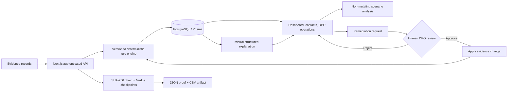

# ComplyLens — four-slide pitch deck prompts

Use a 16:9 presentation with an executive Indian-regtech visual system: warm off-white background, deep teal (`#0C6B58`), emerald accents, charcoal text, restrained amber for risk, thin grid lines, and clean sans-serif typography. Avoid cartoons, mascots, glassmorphism, exaggerated claims, stock-padlock imagery, and dense paragraphs. Use diagrams, product screenshots, and large evidence-backed numbers. Add a small source footer on every slide. Team name: **Cloud Code**. Project name: **ComplyLens**.

Replace `[DEPLOYED_URL]` after deployment. Generate both QR codes as real, scannable codes with a white quiet zone and test them before presenting.

## Slide 1 — problem and opportunity

**Prompt**

> Create slide 1 titled “ComplyLens” with the team label “CLOUD CODE” above it and the subtitle “Evidence-led DPDP compliance operations.” Present the problem in one sentence: “DPDP evidence is fragmented across systems, assessments are difficult to reproduce, and remediation decisions often lack a verifiable human approval trail.” Use three large statistical tiles: “969.10M internet subscribers in India — March 2025,” “29.44 lakh cyber-security incidents tracked in 2025,” and “Up to ₹250 crore statutory penalty for failure to take reasonable security safeguards.” Add a compact flow showing the operational gap: scattered evidence → manual interpretation → inconsistent remediation → weak auditability. End with the solution thesis: “Deterministic rules decide. AI explains. Humans approve. Cryptographic verification proves the trail.” Keep the statutory figure clearly labelled as a maximum, not predicted liability. Add source footnotes linking to TRAI’s 2024–25 performance indicators, the March 2026 PIB/CERT-In incident release, and the official DPDP Act 2023 Schedule.

Sources:

- TRAI: https://trai.gov.in/sites/default/files/2025-07/PR_No.55of2025.pdf
- PIB/CERT-In: https://www.pib.gov.in/PressReleasePage.aspx?PRID=2244504&lang=1&reg=3
- DPDP Act: https://www.meity.gov.in/static/uploads/2024/06/2bf1f0e9f04e6fb4f8fef35e82c42aa5.pdf

## Slide 2 — architecture

**Prompt**

> Create slide 2 titled “Architecture: deterministic core, governed intelligence.” Draw a left-to-right architecture diagram with five layers. Layer 1, Evidence: contacts, consent records, processing purposes, retention dates, notices, and minimization status. Layer 2, Application: responsive Next.js UI and authenticated API routes with signed HTTP-only sessions and Zod validation. Layer 3, Decision Core: versioned deterministic DPDP rules calculate score, status, severity gates, findings, and recommendations. Layer 4, Governance: non-mutating scenario analysis; Mistral receives only minimized persisted verdict metadata and returns a structured explanation; remediation requires DPO approval before evidence changes and reassessment. Layer 5, Assurance: PostgreSQL/Prisma stores append-only assessments and results; audit events are SHA-256 hash-chained, sealed into Merkle checkpoints, and exported as JSON proofs or board CSV. Use a bold boundary around the deterministic decision core. Place AI outside that boundary with a one-way “explain only” arrow. Show the closed remediation loop from finding → request → DPO approve/reject → apply → reassess → new history point. Use accurate technical icons and no decorative cloud clip art.

Suggested diagram syntax for tools that accept Mermaid:

## Slide 3 — scale and production roadmap

**Prompt**

> Create slide 3 titled “Scale with control, not complexity.” Use a three-stage roadmap: Pilot (10K records), Enterprise (1M records), and Ecosystem (100M+ records). Under Pilot show the current stack: stateless Next.js service, managed PostgreSQL, versioned rules, role-based human approval, and structured AI explanations. Under Enterprise show horizontal web scaling, database connection pooling, background assessment queues, partitioned assessment/audit tables, cached portfolio analytics, SSO/RBAC, tenant isolation, rate limiting, observability, backups, and disaster recovery. Under Ecosystem show regional deployment in India, rule-pack version governance, event-stream ingestion, read replicas/warehouse analytics, external Merkle-root anchoring or WORM storage, automated evidence connectors, and policy-as-code release approvals. Add four cross-cutting guardrails along the bottom: data minimization, encryption and key rotation, data residency/vendor review, and legal validation of rule mappings. Show that AI scales independently and remains outside scoring and write paths. Avoid claiming blockchain or absolute immutability.

## Slide 4 — working artifacts and call to action

**Prompt**

> Create slide 4 titled “Working product, verifiable artifacts.” Use two columns. Left column: a polished product screenshot montage showing remediation impact analysis, assessment history, structured AI briefing, DPO remediation approval, breach/rights operations, and audit integrity verification. Add concise artifact chips: “32 automated tests,” “strict TypeScript,” “production build verified,” “browser journey verified,” “board CSV export,” and “Merkle proof JSON.” Right column: two large, independently scannable QR cards. Card 1 label “Source code” with URL `https://github.com/nischala755/salesforce`. Card 2 label “Live demo” with URL `[DEPLOYED_URL]`. Add a smaller text line beneath each QR with the full URL. Finish with: “From fragmented evidence to reproducible decisions and human-approved remediation.” Include a small footer: “Operational aid; not legal certification or legal advice.” Do not place passwords or API keys on the slide.

## Final deck QA prompt

> Audit the four slides for factual accuracy, professional tone, consistent terminology, readable 16:9 layout, and scannable QR codes. Ensure “Remediation impact analysis,” “Compliance assessment history,” “Remediation scenario analysis,” and “Audit integrity verification” are used consistently. Remove playful terms such as radar, time machine, command center, magic, fingerprint, or immutable blockchain. Confirm that cyber-security incidents are not described as personal-data breaches and that ₹250 crore is described only as a statutory maximum for the specified Schedule item, not as likely liability.
